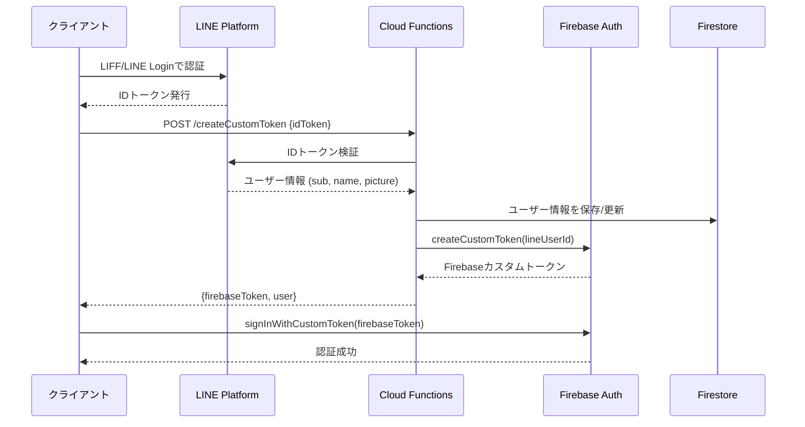

# createCustomToken API 使用ガイド

## 概要

`createCustomToken` は、LINEのIDトークンをFirebaseのカスタムトークンに変換するCloud Functionです。
これにより、LINE Loginで認証したユーザーをFirebase Authenticationに統合できます。

## エンドポイント

```
POST https://asia-northeast2-YOUR_PROJECT_ID.cloudfunctions.net/createCustomToken
```

**リージョン**: `asia-northeast2` (東京)

## リクエスト

### ヘッダー

```
Content-Type: application/json
```

### ボディ

```json
{
  "idToken": "LINE_ID_TOKEN_HERE"
}
```

| パラメータ | 型 | 必須 | 説明 |
|----------|-----|-----|------|
| idToken | string | ✅ | LIFFまたはLINE Login SDKから取得したIDトークン |

## レスポンス

### 成功時 (200 OK)

```json
{
  "firebaseToken": "FIREBASE_CUSTOM_TOKEN",
  "user": {
    "uid": "LINE_USER_ID",
    "displayName": "User Name",
    "pictureUrl": "https://profile.line-scdn.net/...",
    "email": "user@example.com"
  }
}
```

| フィールド | 型 | 説明 |
|-----------|-----|------|
| firebaseToken | string | Firebaseカスタムトークン（`signInWithCustomToken`で使用） |
| user.uid | string | LINEユーザーID（Firestoreのドキュメントキー） |
| user.displayName | string | ユーザーの表示名 |
| user.pictureUrl | string | プロフィール画像URL |
| user.email | string | メールアドレス（取得可能な場合） |

### エラー時

#### 400 Bad Request - IDトークンが未提供

```json
{
  "error": "idToken is required"
}
```

#### 401 Unauthorized - IDトークンが無効

```json
{
  "error": "LINE token verification failed",
  "details": {
    "error": "invalid_request",
    "error_description": "id_token is invalid"
  }
}
```

#### 405 Method Not Allowed

```json
{
  "error": "Method Not Allowed. Use POST."
}
```

#### 500 Internal Server Error

```json
{
  "error": "Internal Server Error",
  "message": "Error message here"
}
```

## 使用例

### JavaScript/TypeScript (フロントエンド)

```typescript
import liff from '@line/liff';
import { signInWithCustomToken } from 'firebase/auth';
import { auth } from './firebase';

async function loginWithLINE() {
  try {
    // 1. LINEのIDトークンを取得
    const idToken = liff.getIDToken();

    // 2. createCustomToken APIを呼び出し
    const response = await fetch(
      'https://asia-northeast2-YOUR_PROJECT_ID.cloudfunctions.net/createCustomToken',
      {
        method: 'POST',
        headers: {
          'Content-Type': 'application/json',
        },
        body: JSON.stringify({ idToken }),
      }
    );

    const data = await response.json();

    if (!response.ok) {
      throw new Error(data.error);
    }

    // 3. Firebaseカスタムトークンでサインイン
    const userCredential = await signInWithCustomToken(auth, data.firebaseToken);
    
    console.log('Signed in as:', userCredential.user.uid);
    console.log('User info:', data.user);
    
    return userCredential.user;
  } catch (error) {
    console.error('Login failed:', error);
    throw error;
  }
}
```

### cURL

```bash
curl -X POST \
  https://asia-northeast2-YOUR_PROJECT_ID.cloudfunctions.net/createCustomToken \
  -H 'Content-Type: application/json' \
  -d '{
    "idToken": "eyJhbGciOiJIUzI1NiIsInR5cCI6IkpXVCJ9..."
  }'
```

### React コンポーネント例

```tsx
import React, { useEffect } from 'react';
import liff from '@line/liff';
import { loginWithLINE } from './utils/auth';

const LiffLogin: React.FC = () => {
  useEffect(() => {
    initializeLiff();
  }, []);

  const initializeLiff = async () => {
    try {
      await liff.init({ liffId: 'YOUR_LIFF_ID' });
      
      if (!liff.isLoggedIn()) {
        liff.login();
        return;
      }

      // LINEログイン済み → Firebase認証
      const user = await loginWithLINE();
      console.log('Firebase user:', user);
      
      // ここで画面遷移などの処理
    } catch (error) {
      console.error('LIFF initialization failed:', error);
    }
  };

  return (
    <div>
      <p>Loading...</p>
    </div>
  );
};
```

## 処理フロー



## データベース

### Firestore: users コレクション

APIは自動的に `users` コレクションにユーザー情報を保存します。

**ドキュメントID**: LINEユーザーID (`sub`)

```typescript
{
  lineUserId: string;        // LINEユーザーID
  displayName: string;       // 表示名
  pictureUrl: string;        // プロフィール画像URL
  email: string;             // メールアドレス
  role: 'user' | 'admin';    // 権限（デフォルト: 'user'）
  createdAt: Timestamp;      // 作成日時
  updatedAt: Timestamp;      // 更新日時
}
```

## セキュリティ

### CORS

- `Access-Control-Allow-Origin: *` - すべてのオリジンを許可
- プロダクション環境では特定のドメインに制限することを推奨

### 認証フロー

1. ✅ LINEのIDトークンは LINE Platform で検証
2. ✅ 検証成功後のみFirebaseカスタムトークンを発行
3. ✅ FirestoreのセキュリティルールでAPI経由のアクセスを制御

### トークンの有効期限

- **LINE IDトークン**: 発行から10分間有効
- **Firebaseカスタムトークン**: 発行から1時間有効

## トラブルシューティング

### "LINE_LOGIN_CHANNEL_ID is not configured"

**原因**: 環境変数が設定されていない

**解決方法**:
```bash
firebase functions:config:set line.login_channel_id="YOUR_CHANNEL_ID"
firebase deploy --only functions
```

### "LINE token verification failed"

**原因**: 
- IDトークンが無効または期限切れ
- チャネルIDが間違っている

**解決方法**:
1. IDトークンを再取得
2. LINE_LOGIN_CHANNEL_IDが正しいか確認
3. LINE Login チャネル（Messaging APIチャネルではない）のIDを使用しているか確認

### CORS エラー

**原因**: ブラウザのCORSポリシー

**解決方法**:
- 関数は既にCORSヘッダーを設定済み
- OPTIONS リクエストへの対応も実装済み
- それでもエラーが出る場合は、Firebase Hostingを経由してアクセス

### "Invalid custom token"

**原因**: 古いカスタムトークンを使用

**解決方法**:
- トークンは1時間で期限切れ
- 期限切れの場合は再度 createCustomToken を呼び出し

## 参考リンク

- [LINE Login v2.1 API Reference](https://developers.line.biz/en/reference/line-login/)
- [Firebase Custom Token](https://firebase.google.com/docs/auth/admin/create-custom-tokens)
- [LIFF SDK](https://developers.line.biz/en/docs/liff/overview/)
