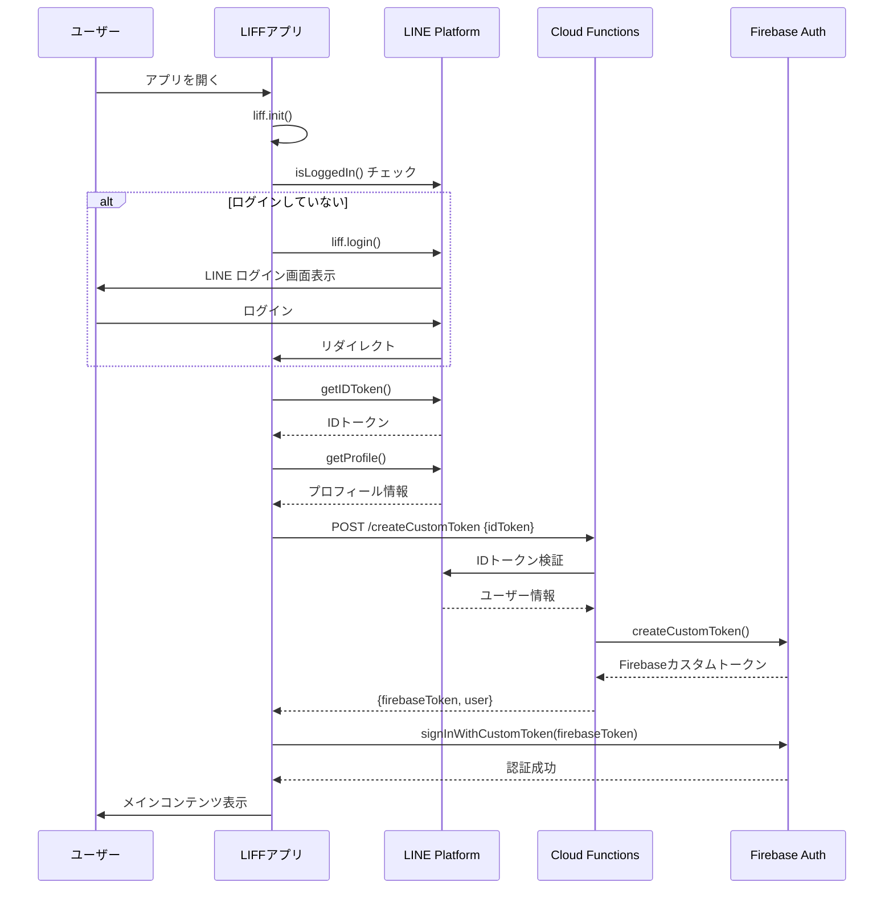

# LIFF自動ログイン実装ガイド

## 概要

このドキュメントでは、LIFFアプリ起動時にLINEログインとFirebaseへの自動ログインを実行する実装について説明します。

## 実装ファイル

### 1. `public/src/App.tsx`

LIFFアプリのメインコンポーネント。起動時に以下の処理を自動実行します:

1. **LIFF初期化**: `liff.init({ liffId })`
2. **LINEログインチェック**: `liff.isLoggedIn()`
3. **IDトークン取得**: `liff.getIDToken()`
4. **プロフィール取得**: `liff.getProfile()`
5. **カスタムトークン取得**: `axios.post(createCustomTokenUrl, { idToken })`
6. **Firebaseログイン**: `signInWithCustomToken(auth, firebaseToken)`

### 2. `public/src/config.ts`

設定ファイル。以下の定数を定義:

- `liffId`: LINE LIFF ID
- `createCustomTokenUrl`: createCustomToken APIのエンドポイント

### 3. `public/src/App.css`

ローディングとエラー表示のスタイル定義

## セットアップ手順

### 1. 依存関係のインストール

```bash
cd public
npm install
```

必要なパッケージ:
- `axios`: ^1.6.2
- `@line/liff`: ^2.23.1
- `firebase`: ^10.7.1
- `react-router-dom`: ^6.20.1

### 2. 環境変数の設定

`.env` ファイルを作成し、以下の値を設定:

```bash
# Firebase設定
REACT_APP_FIREBASE_API_KEY=your_api_key
REACT_APP_FIREBASE_AUTH_DOMAIN=your_project_id.firebaseapp.com
REACT_APP_FIREBASE_PROJECT_ID=your_project_id
REACT_APP_FIREBASE_STORAGE_BUCKET=your_project_id.appspot.com
REACT_APP_FIREBASE_MESSAGING_SENDER_ID=your_sender_id
REACT_APP_FIREBASE_APP_ID=your_app_id

# LINE LIFF ID
REACT_APP_LIFF_ID=1234567890-abcdefgh

# 環境（development または production）
NODE_ENV=development
```

### 3. config.ts の更新

`public/src/config.ts` を開き、プレースホルダーを実際の値に置き換え:

```typescript
// Firebase設定
export const firebaseConfig = {
  apiKey: process.env.REACT_APP_FIREBASE_API_KEY || "YOUR_API_KEY",
  authDomain: process.env.REACT_APP_FIREBASE_AUTH_DOMAIN || "YOUR_AUTH_DOMAIN",
  projectId: process.env.REACT_APP_FIREBASE_PROJECT_ID || "YOUR_PROJECT_ID",
  storageBucket: process.env.REACT_APP_FIREBASE_STORAGE_BUCKET || "YOUR_STORAGE_BUCKET",
  messagingSenderId: process.env.REACT_APP_FIREBASE_MESSAGING_SENDER_ID || "YOUR_MESSAGING_SENDER_ID",
  appId: process.env.REACT_APP_FIREBASE_APP_ID || "YOUR_APP_ID"
};

// LINE LIFF ID
export const liffId = process.env.REACT_APP_LIFF_ID || "1234567890-abcdefgh";

// createCustomToken APIエンドポイント
export const createCustomTokenUrl = process.env.NODE_ENV === 'production'
  ? "https://asia-northeast1-YOUR_PROJECT_ID.cloudfunctions.net/createCustomToken"
  : "http://localhost:5001/YOUR_PROJECT_ID/asia-northeast1/createCustomToken";
```

**重要**: `YOUR_PROJECT_ID` を実際のFirebase プロジェクトIDに置き換えてください。

### 4. Cloud Functionsのデプロイ

```bash
# functionsディレクトリに移動
cd ../functions

# 依存関係インストール
npm install

# ビルド
npm run build

# デプロイ
firebase deploy --only functions:createCustomToken
```

### 5. LIFF アプリの設定

1. [LINE Developers Console](https://developers.line.biz/console/) にアクセス
2. プロバイダーとLINE Loginチャネルを選択
3. LIFFタブを選択
4. 「追加」をクリックして新しいLIFFアプリを作成

**LIFFアプリ設定**:
- **LIFF app name**: お菓子管理アプリ
- **Size**: Full
- **Endpoint URL**: `https://YOUR_PROJECT_ID.web.app/`
- **Scope**: 
  - ✅ `profile`
  - ✅ `openid`
  - ✅ `email`
- **Bot link feature**: Optional (LINE Botと連携する場合は On)

5. 作成後、LIFF IDをコピーして `.env` ファイルに設定

## 処理フロー



## 状態管理

### State変数

```typescript
const [user, setUser] = useState<FirebaseUser | null>(null);
const [loading, setLoading] = useState(true);
const [isLiff, setIsLiff] = useState(false);
const [error, setError] = useState<string>('');
const [liffProfile, setLiffProfile] = useState<LiffProfile | null>(null);
```

### 表示状態

1. **ローディング中** (`loading === true`)
   - スピナーとメッセージを表示
   - LINEプロフィールがある場合は名前も表示

2. **エラー発生** (`error !== ''`)
   - エラーメッセージと再試行ボタンを表示

3. **ログイン成功**
   - LIFF環境: `<LiffApp />` コンポーネントを表示
   - Web環境: 管理画面またはログインページにルーティング

## エラーハンドリング

### エラーの種類

1. **LIFF初期化エラー**
   ```typescript
   catch (error) {
     console.error('LIFF initialization failed:', error);
     setError('初期化に失敗しました');
   }
   ```

2. **IDトークン取得エラー**
   ```typescript
   if (!idToken) {
     throw new Error('Failed to get LINE ID token');
   }
   ```

3. **API呼び出しエラー**
   ```typescript
   if (error.response) {
     errorMessage = error.response.data?.error || 'サーバーエラーが発生しました';
   }
   ```

### 再試行機能

エラー画面に「再試行」ボタンを配置し、クリックで `initializeApp()` を再実行:

```typescript
<button 
  className="btn btn-primary"
  onClick={() => {
    setError('');
    setLoading(true);
    initializeApp();
  }}
>
  再試行
</button>
```

## デバッグ

### ローカル開発

```bash
# Firebase Emulatorを起動
firebase emulators:start

# 別のターミナルでReactアプリを起動
cd public
npm start
```

### ブラウザでのテスト

LIFF環境をシミュレートするには、以下のURLでアクセス:

```
https://liff.line.me/1234567890-abcdefgh
```

### ログの確認

開発者ツールのコンソールで以下のログを確認:

1. ✅ "Running in LIFF environment"
2. ✅ "Logged in to LINE"
3. ✅ "LINE ID token obtained"
4. ✅ "LINE profile: {userId, displayName, pictureUrl}"
5. ✅ "Requesting Firebase custom token..."
6. ✅ "Firebase custom token received"
7. ✅ "Signing in to Firebase..."
8. ✅ "Successfully signed in to Firebase!"

## トラブルシューティング

### 1. "LIFF initialization failed"

**原因**: LIFF IDが無効

**解決方法**:
- `.env` ファイルの `REACT_APP_LIFF_ID` を確認
- `config.ts` の `liffId` を確認
- LINE Developers Consoleでアプリが有効か確認

### 2. "Failed to get LINE ID token"

**原因**: LINEログインが完了していない

**解決方法**:
- LINEアプリ内でアプリを開く
- LIFFのScope設定で `openid` が有効か確認

### 3. "LINE token verification failed"

**原因**: IDトークンが無効、またはCloud Functionsの設定エラー

**解決方法**:
- Cloud Functionsの環境変数を確認:
  ```bash
  firebase functions:config:get
  ```
- `line.login_channel_id` が正しく設定されているか確認

### 4. "signInWithCustomToken failed"

**原因**: Firebaseカスタムトークンが無効

**解決方法**:
- Cloud Functionsのログを確認:
  ```bash
  firebase functions:log --only createCustomToken
  ```
- Firebase Admin SDKが正しく初期化されているか確認

### 5. CORS エラー

**原因**: ローカル開発時のCORS設定

**解決方法**:
- Cloud FunctionsでCORSが有効になっているか確認（既に実装済み）
- `createCustomTokenUrl` のURLが正しいか確認

## 本番デプロイ

### 1. ビルド

```bash
cd public
npm run build
```

### 2. デプロイ

```bash
# ルートディレクトリで
firebase deploy
```

または個別にデプロイ:

```bash
# Hostingのみ
firebase deploy --only hosting

# Functionsのみ
firebase deploy --only functions
```

### 3. 動作確認

1. `https://YOUR_PROJECT_ID.web.app/` にアクセス
2. LINEアプリで `https://liff.line.me/YOUR_LIFF_ID` を開く
3. 自動ログインが実行されることを確認

## セキュリティ考慮事項

1. ✅ IDトークンの検証はサーバーサイド（Cloud Functions）で実施
2. ✅ Firestoreセキュリティルールで認証済みユーザーのみアクセス可能
3. ✅ カスタムトークンの有効期限は1時間
4. ⚠️ 本番環境ではCORSを特定のドメインに制限することを推奨

## 参考リンク

- [LIFF API Reference](https://developers.line.biz/en/reference/liff/)
- [Firebase Custom Tokens](https://firebase.google.com/docs/auth/admin/create-custom-tokens)
- [LINE Login v2.1 API](https://developers.line.biz/en/reference/line-login/)
